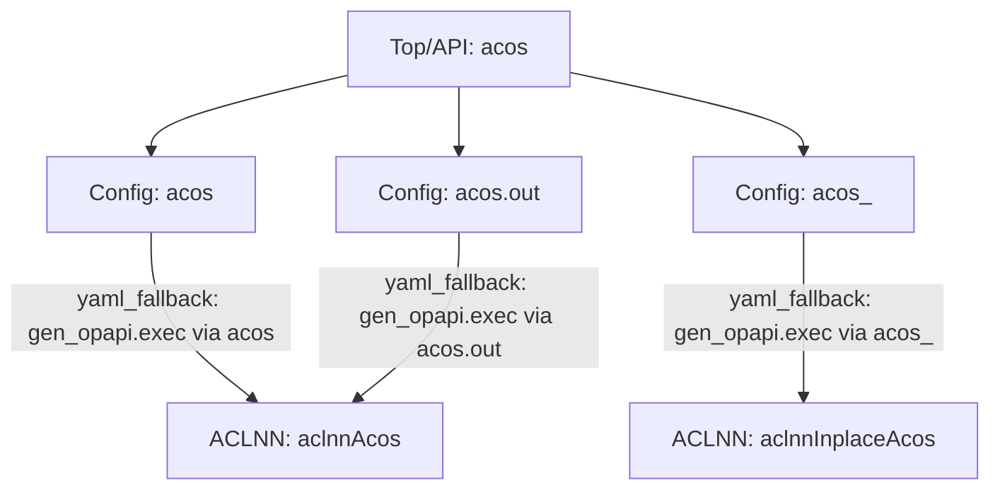

# `acos` Call Chain

- status: `ok`
- entries: `1`
- visited_nodes: `2`
- paths: `3`
- overload_count: `3`
- has_backward: `False`
- backward_match: `none`
- aclnn_catalog_size: `2`
- aclnn_gap_suspects: `0`
- gap_judge_source: `skill_backfill`

## Front Signatures

- `acos(Tensor self) -> Tensor`
- `acos.out(Tensor self, *, Tensor(a!) out) -> Tensor(a!)`
- `acos_(Tensor(a!) self) -> Tensor(a!)`

## Backward Bindings

- `(none)`

## Dispatch Summary

- `aclnnAcos` | shape=`logic_preprocessed` | strict_direct=`False` | paths=`2`
- `aclnnInplaceAcos` | shape=`logic_preprocessed` | strict_direct=`False` | paths=`1`

## ACLNN Completeness

- observed_apis: `aclnnAcos, aclnnInplaceAcos`
- final_api_catalog: `aclnnAcos, aclnnInplaceAcos`
- suspected_missing_apis: `(none)`

## Layer Legend

- `Top/API`: top op entry name
- `Python`: symbol from `.py`
- `Config`: symbol from `.yaml/.yml/.json/...`
- `C++`: symbol from `.cpp/.h/...`
- `ACLNN`: backend aclnn operator

## Tree

```text
[Top/API] acos
├─ [Config] acos -> [ACLNN] aclnnAcos
   └─ cond: yaml_fallback: gen_opapi.exec via acos
├─ [Config] acos.out -> [ACLNN] aclnnAcos
   └─ cond: yaml_fallback: gen_opapi.exec via acos.out
└─ [Config] acos_ -> [ACLNN] aclnnInplaceAcos
   └─ cond: yaml_fallback: gen_opapi.exec via acos_
```

## Graph



## Paths

### 1. `aclnnAcos`

- chain: `[Config] acos`
- source: `config_fallback`
- dispatch_note: `logic_preprocessed`
- endpoint: `file:///Users/fanzhilan/project/mindspore-agent/workspace-mindspore-framework/code/op-plugin/op_plugin/config/op_plugin_functions.yaml`:752:1
- conditions:
  - `yaml_fallback: gen_opapi.exec via acos`

### 2. `aclnnAcos`

- chain: `[Config] acos.out`
- source: `config_fallback`
- dispatch_note: `logic_preprocessed`
- endpoint: `file:///Users/fanzhilan/project/mindspore-agent/workspace-mindspore-framework/code/op-plugin/op_plugin/config/op_plugin_functions.yaml`:761:1
- conditions:
  - `yaml_fallback: gen_opapi.exec via acos.out`

### 3. `aclnnInplaceAcos`

- chain: `[Config] acos_`
- source: `config_fallback`
- dispatch_note: `logic_preprocessed`
- endpoint: `file:///Users/fanzhilan/project/mindspore-agent/workspace-mindspore-framework/code/op-plugin/op_plugin/config/op_plugin_functions.yaml`:767:1
- conditions:
  - `yaml_fallback: gen_opapi.exec via acos_`
