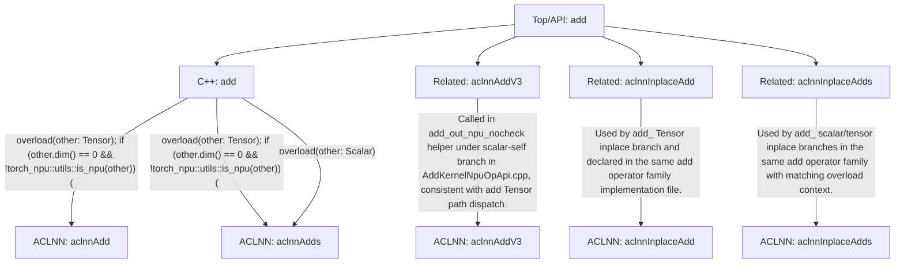

# `add` Call Chain

- status: `ok`
- entries: `4`
- visited_nodes: `15`
- paths: `3`
- overload_count: `5`
- has_backward: `False`
- backward_match: `none`
- aclnn_catalog_size: `5`
- aclnn_gap_suspects: `3`
- gap_judge_source: `skill_backfill`

## Front Signatures

- `add.Scalar(Tensor self, Scalar other, Scalar alpha=1) -> Tensor`
- `add.Tensor(Tensor self, Tensor other, *, Scalar alpha=1) -> Tensor`
- `add.out(Tensor self, Tensor other, *, Scalar alpha=1, Tensor(a!) out) -> Tensor(a!)`
- `add_.Scalar(Tensor(a!) self, Scalar other, Scalar alpha=1) -> Tensor(a!)`
- `add_.Tensor(Tensor(a!) self, Tensor other, *, Scalar alpha=1) -> Tensor(a!)`

## Backward Bindings

- `(none)`

## Dispatch Summary

- `aclnnAdd` | shape=`logic_preprocessed` | strict_direct=`False` | paths=`1`
- `aclnnAdds` | shape=`mixed` | strict_direct=`True` | paths=`2`

## ACLNN Completeness

- observed_apis: `aclnnAdd, aclnnAdds`
- final_api_catalog: `aclnnAdd, aclnnAddV3, aclnnAdds, aclnnInplaceAdd, aclnnInplaceAdds`
- suspected_missing_apis: `aclnnAddV3, aclnnInplaceAdd, aclnnInplaceAdds`
- gap_candidates:
  - `aclnnAddV3` | likely_related=`True` | confidence=`0.96` | reason=`Called in add_out_npu_nocheck helper under scalar-self branch in AddKernelNpuOpApi.cpp, consistent with add Tensor path dispatch.`
  - `aclnnInplaceAdd` | likely_related=`True` | confidence=`0.93` | reason=`Used by add_ Tensor inplace branch and declared in the same add operator family implementation file.`
  - `aclnnInplaceAdds` | likely_related=`True` | confidence=`0.93` | reason=`Used by add_ scalar/tensor inplace branches in the same add operator family with matching overload context.`

## Layer Legend

- `Top/API`: top op entry name
- `Python`: symbol from `.py`
- `Config`: symbol from `.yaml/.yml/.json/...`
- `C++`: symbol from `.cpp/.h/...`
- `ACLNN`: backend aclnn operator

## Tree

```text
[Top/API] add
├─ [C++] add -> [ACLNN] aclnnAdd
   ├─ cond: overload(other: Tensor)
   └─ cond: if (other.dim() == 0 && !torch_npu::utils::is_npu(other)) {
├─ [C++] add -> [ACLNN] aclnnAdds
   ├─ cond: overload(other: Tensor)
   └─ cond: if (other.dim() == 0 && !torch_npu::utils::is_npu(other)) {
└─ [C++] add -> [ACLNN] aclnnAdds
   └─ cond: overload(other: Scalar)
├─ [Related] add -> [ACLNN] aclnnAddV3
   └─ reason: Called in add_out_npu_nocheck helper under scalar-self branch in AddKernelNpuOpApi.cpp, consistent with add Tensor path dispatch.
├─ [Related] add -> [ACLNN] aclnnInplaceAdd
   └─ reason: Used by add_ Tensor inplace branch and declared in the same add operator family implementation file.
├─ [Related] add -> [ACLNN] aclnnInplaceAdds
   └─ reason: Used by add_ scalar/tensor inplace branches in the same add operator family with matching overload context.
```

## Graph



## Paths

### 1. `aclnnAdd`

- chain: `[C++] add`
- source: `lsp`
- dispatch_note: `logic_preprocessed`
- endpoint: `file:///Users/fanzhilan/project/mindspore-agent/workspace-mindspore-framework/code/op-plugin/op_plugin/ops/opapi/AddKernelNpuOpApi.cpp`:92:22
- conditions:
  - `overload(other: Tensor)`
  - `if (other.dim() == 0 && !torch_npu::utils::is_npu(other)) {`

### 2. `aclnnAdds`

- chain: `[C++] add`
- source: `lsp`
- dispatch_note: `logic_preprocessed`
- endpoint: `file:///Users/fanzhilan/project/mindspore-agent/workspace-mindspore-framework/code/op-plugin/op_plugin/ops/opapi/AddKernelNpuOpApi.cpp`:93:22
- conditions:
  - `overload(other: Tensor)`
  - `if (other.dim() == 0 && !torch_npu::utils::is_npu(other)) {`

### 3. `aclnnAdds`

- chain: `[C++] add`
- source: `lsp`
- dispatch_note: `strict_direct`
- endpoint: `file:///Users/fanzhilan/project/mindspore-agent/workspace-mindspore-framework/code/op-plugin/op_plugin/ops/opapi/AddKernelNpuOpApi.cpp`:120:18
- conditions:
  - `overload(other: Scalar)`
